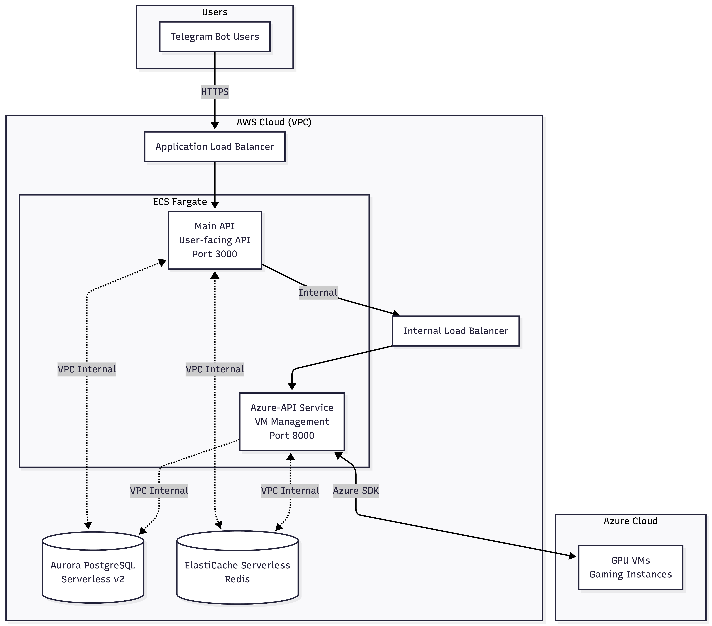

# WASD-Cloud_Architecture
Hey everyone, this is the project I've been working on for the past few months, and it is closed beta right now. Check this out, and feel free to reach me for source code.
# WASD Cloud – Hybrid Cloud Gaming Backend

WASD Cloud is a production-running **cloud gaming backend** that streams PC games from GPU-enabled virtual machines.

The system uses a **hybrid cloud approach**:
- **AWS** for application APIs, state, and orchestration
- **Azure** for GPU-backed gaming virtual machines

The project is designed with a strong focus on **cost efficiency**, **operational simplicity**, and **real-world trade-offs**.

---

## High-Level Architecture

**Flow summary:**
- Users interact via a Telegram bot
- Requests hit AWS through an Application Load Balancer
- Backend services run on ECS Fargate
- GPU game sessions run on Azure VMs
- Game streaming traffic flows directly from Azure to users

---

## Architecture Overview

The system is split into two logical planes.

### Control Plane (AWS)

Runs on **AWS ECS Fargate** and handles:
- User authentication and session management
- Payment processing (Razorpay)
- Session lifecycle coordination
- Persistent state and metadata

This layer is lightweight, API-driven, and optimized for reliability.

### Data Plane (Azure)

Runs on **Azure GPU VMs (Spot-first, On-Demand fallback)** and handles:
- Game execution
- High-bandwidth video/audio streaming

Streaming traffic does **not** pass through AWS, keeping AWS costs predictable.

---

## Core Services

### Main API (User-Facing)

- Platform: ECS Fargate
- Port: 3000
- Exposure: Public (External ALB)

Handles:
- Telegram bot webhooks
- Authentication
- Payments
- Session tracking and billing

This service is latency-sensitive and mostly I/O bound.

---

### Azure-API (Internal VM Orchestrator)

- Platform: ECS Fargate
- Port: 8000
- Exposure: Internal-only (Internal ALB)

Handles:
- Azure VM lifecycle (start/stop/delete)
- Disk management
- Spot quota and eviction handling
- Azure SDK interactions

VM operations are slow and failure-prone, so this service is isolated from user-facing traffic.

---

## Networking Architecture

The application runs inside a single AWS VPC with a multi-tier setup:

- Public subnet:
  - External Application Load Balancer
  - NAT Gateway
- Private subnet 1:
  - Main API ECS tasks
- Private subnet 2:
  - Azure-API ECS tasks
  - Internal Application Load Balancer

ECS tasks do not have public IPs.  
All outbound traffic exits via a NAT Gateway.

---

## Data Layer

**PostgreSQL**
- Aurora PostgreSQL Serverless v2
- Single cluster with two logical databases
- Cost-efficient isolation with shared scaling

**Redis**
- ElastiCache Serverless Redis
- Used for session state, locks, and rate limiting
- Logical isolation using key prefixes per service

---

## CI/CD & Deployment

CI/CD is implemented using **GitHub Actions**.

Deployment flow:
1. Build Docker image (multi-stage)
2. Push image to Amazon ECR
3. Register new ECS task definition
4. Trigger ECS service deployment
5. Automatic rollback on failure

Deployments are **zero-downtime** using ECS rolling updates and circuit breakers.

---

## Trade-offs & Limitations

This architecture makes **intentional trade-offs**:

- Single-AZ ECS deployment to reduce cost
- Azure Spot VMs may get evicted
- Minimal service count to reduce operational overhead

Mitigations include:
- Redis-based idempotency locks
- Spot → On-Demand VM fallback
- Automated deployment rollback

These trade-offs are acceptable for the current scale.

---

## Cost Awareness

Approximate monthly AWS costs:
- ECS Fargate: $20–30
- Aurora Serverless v2: $50–80
- ElastiCache Serverless: $20–40
- NAT Gateway & ALB: $50–60

Azure GPU VMs are billed per-use to users.

Cost efficiency was a primary design constraint.

---

## Tech Stack

- AWS ECS Fargate
- Azure GPU VMs
- FastAPI (Python)
- PostgreSQL (Aurora Serverless)
- Redis (ElastiCache Serverless)
- Docker
- GitHub Actions
- Cloudflare
- New Relic

---

## Summary

This project demonstrates:
- Real-world hybrid cloud architecture
- Cost-driven design decisions
- Production deployment and monitoring
- Clear separation of concerns

It is intentionally simple, production-running, and easy to reason about.

